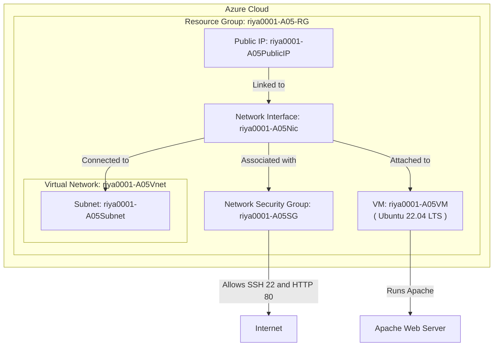

# 📘 Terraform Project - CST8918 A05

## **Cloud Infrastructure Deployment using Terraform**
**Author:** *Elmotasembella Riyani*  

---

## **📌 Project Overview**
This repository contains Terraform configuration files for **deploying cloud resources** in **Microsoft Azure**. The project includes:
✅ Deploying an **Ubuntu Virtual Machine**  
✅ Setting up a **Virtual Network (VNet) and Subnet**  
✅ Creating a **Network Security Group (NSG) with SSH & HTTP access**  
✅ Assigning a **Public IP to the VM**  
✅ Automating infrastructure provisioning with **Terraform**  

---

## **📁 Project Structure**
```
📂 cst8918-a05-terraform/
├── main.tf             # Terraform configuration file
├── variables.tf        # Variables for Terraform deployment
├── outputs.tf          # Outputs for Terraform deployment
├── README.md           # Project documentation
├── a05-architecture.png # Architecture diagram (PNG version)
└── .gitignore          # Ignore unnecessary files
```

---

## **📷 Architecture Diagram (Mermaid)**
This **Mermaid diagram** represents the Terraform infrastructure setup:



📌 **This diagram describes the following:**  
- **User** accesses the **VM** via **SSH/HTTP**.  
- The VM is assigned a **Public IP**.  
- Traffic is routed through an **Azure Load Balancer** (if applicable).  
- The **Virtual Network (VNet) and Subnet** manage internal communication.  
- A **Network Security Group (NSG)** ensures only SSH & HTTP traffic is allowed.  
- The **Virtual Machine (VM)** is connected to an **OS Disk**.  

---

## **🛠️ Setup & Deployment**

### **1️⃣ Prerequisites**
Ensure you have the following installed:
- [Terraform](https://developer.hashicorp.com/terraform/downloads) (`v1.5+`)
- [Azure CLI](https://docs.microsoft.com/en-us/cli/azure/install-azure-cli)
- [Git](https://git-scm.com/downloads)

### **2️⃣ Clone the Repository**
```bash
git clone https://github.com/Elmo-Riyani/cst8918-a05-terraform.git
cd cst8918-a05-terraform
```

### **3️⃣ Initialize Terraform**
```bash
terraform init
```

### **4️⃣ Deploy Infrastructure**
```bash
terraform apply
```
📌 **Type `yes` when prompted** to confirm deployment.

### **5️⃣ Retrieve VM Public IP**
```bash
terraform output public_ip
```
🌍 Open `http://<public_ip>` in a browser to verify.

### **6️⃣ Destroy Resources (Cleanup)**
Once the project is complete, **delete all resources** to avoid charges:
```bash
terraform destroy
```

---

## **🚀 Submission Instructions**

1. **Push project to GitHub**:
   ```bash
   git add .
   git commit -m "Added Terraform project files"
   git push origin main
   ```
2. **Submit GitHub repository URL on Brightspace**.

---

## **🔗 Useful Links**
- [Terraform Documentation](https://developer.hashicorp.com/terraform/docs)
- [Azure CLI Documentation](https://docs.microsoft.com/en-us/cli/azure/)
- [Azure Free Trial](https://azure.microsoft.com/en-us/free/)

---

## **📞 Support**
For any issues, create an **issue** in this repository or reach out to the course instructor.

---

🚀 **Your project is now fully ready**  

